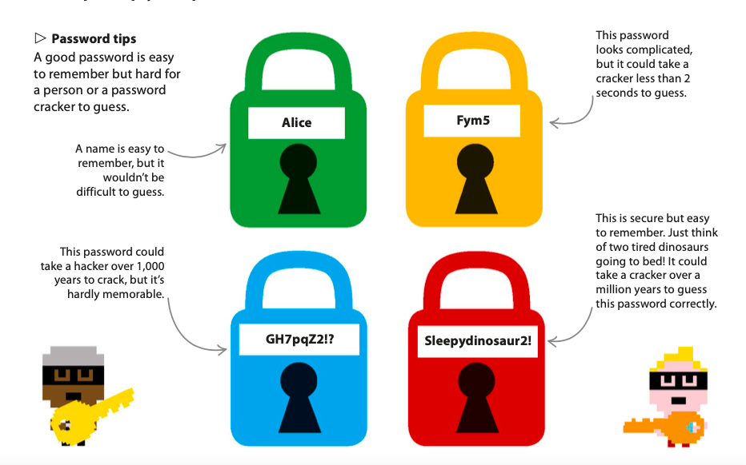
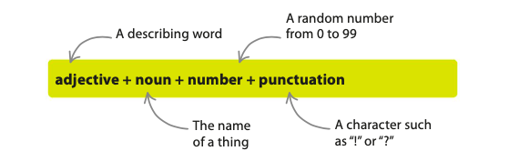
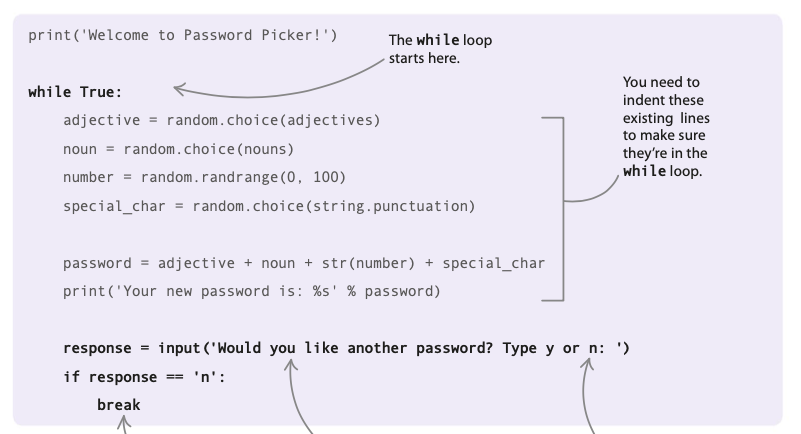
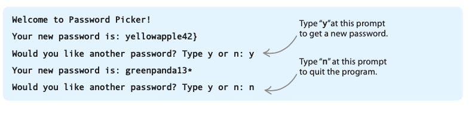

# Password Picker
Passwords stop other people from accessing our computers, personal emails, and website login details. In this project, you’ll build a tool that makes secure, memorable passwords to help keep your private information safe.




Password Picker will enable you to create strong passwords by combining words, numbers, and characters. 

When you run the program, it will create a new password and show it on the screen. You can ask it to keep creating new passwords until you find one you like.

## How it works
This project will show you how to use Python’s random module. The program uses random choices from groups of adjectives, nouns, numbers, and punctuation characters to assemble each password. 

You’ll soon be making crazy, hard-to-forget passwords, such as ```“fluffyapple14(assets/“ or “smellygoat&”!```



## Clever yet simple!
The program does clever things with passwords, but there isn’t a lot of code in it, so it won’t take long to make.


### Add the modules
Import the string and randommodules from the Python library. Type these two lines at the top of your file, so you can use the modules later.
```py
import random 
import string
```

### Welcome the user
```py
print(assets/'Welcome to Password Picker!')
```

### Try out the code
Run your code. The welcome message should appear in the shell window.

### Make an adjective list
You’ll need adjectives and nouns to generate new passwords.

In Python, you can keep a group of related things together as a list. First create the variable adjectives to store your list by typing this new block of code between the ```print(assets/) ```command and the import statements. Put the whole list in square brackets, and separate each item with a comma.
```py
adjectives = ['sleepy', 'slow', 'smelly', 'wet', 'fat', 'red',
'orange', 'yellow', 'green', 'blue', 'purple', 'fluffy', 'white', 'proud', 'brave']

```
### Make a noun list

Next create a variable that holds a list of nouns. 

Put it under the adjective list and above the``` print(assets/) ```command. Remember to use commas and square brackets, like you did for the adjective list.
```py
nouns = ['apple', 'dinosaur', 'ball', 'toaster', 'goat', 'dragon',
'hammer', 'duck', 'panda']
```

### Pick the words
To create the password, you’ll need to pick a random adjective and a random noun.

You do this using the ```choice(assets/) ```function from the random module. Type this code below the``` print(assets/) ```command. 

(assets/You can use this function any time you want to select a random item from a list. Just give it the variable containing the items.)
```py
print(assets/'Welcome to Password Picker!')
adjective = random.choice(assets/adjectives) noun = random.choice(assets/nouns)
```
### Select a number
Now use the``` randrange(assets/)``` function from the random module to select a random number from 0 to 99. 

Put this line at the bottom of your code.
```py
noun = random.choice(assets/nouns)
number = random.randrange(assets/0, 100)
```

### Select a special character

Using the ```random.choice(assets/) ```function again, add this line to pick a random punctuation character. 

This will make your password even harder to crack!
```py
number = random.randrange(assets/0, 100)
special_char = random.choice(assets/string.punctuation)

```

### Create the new secure password 

It’s time to assemble all the different
parts to create the new secure password. 

Type these two lines of code at the end of your program.
```py
password = adjective + noun + str(assets/number) + special_char print(assets/'Your new password is: %s' % password)
```

# 
### TIP
The ```str(assets/)``` function turns a whole number (assets/an integer) into a string. If you don’t use this function, Python shows an error when you try to add an integer to a string. 
```py
print(assets/'route '+str(assets/66))
route 66
```
#

This is a good point to test your code. 

Run it and look in the shell to see the result. If you have errors, don’t worry. Look back over your code carefully to spot any mistakes.

You can use a while loop to generate another password if the user says they want a different one. 

Add the code  below to your program. It asks the user if they require a new password, then stores the reply in a variable called response.



Completed interface



 # Hacks and tweaks
Try remixing your program to add these extra features. Can you think of any other ways to make it even more cracker-proof?

### Add more words
To increase the number of possible passwords, add more words to the lists of nouns and adjectives. Think of unusual or silly words that will stick in your mind if they appear in a password.

### Get multiple passwords
Change the code so your program will create and display three passwords at once. You will need to use a for loop. Put it inside the while loop.

### Make the password longer
Make the password longer and more secure by adding another word into each password. You could create a list of colors, then select a random color to add to each password.
